  

  

## 📌 About Me
- 🔭 I am currently working on building my own Small Language Model (publish soon :]).
- 💬 Let's discuss about  Machine Learning, Artificial Intelligence, New technologies research being done.
- 📫 How to reach me ashwinrajhansofficial@gmail.com

## 🧠 My Focus Areas
- Transformer Architecture
- Large Language Models (LLMs)
- Tokenization Algorithms (BPE, Custom Tokenizers)
- Deep Learning Systems
- Natural Language Processing (NLP)
- Model Training & Optimization
- High-Performance Computing (CPU/GPU)
- AI Systems Design

## 📊 GitHub Stats & Trophies

  
  

  

  

  

## 🛠️ Languages & Tools

> ## Programming Languages

      

> ## Frontend

 

> ## Backend

 

> ## Database

> ## Tools

 

  

## 🔗 Connect with Me

 

  

